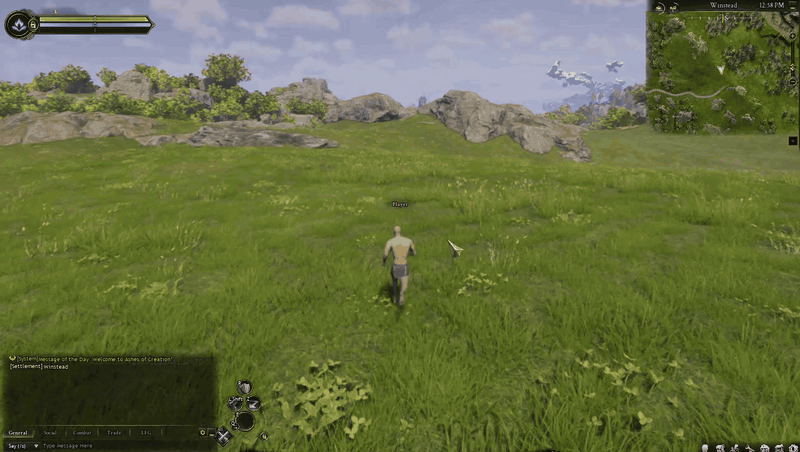
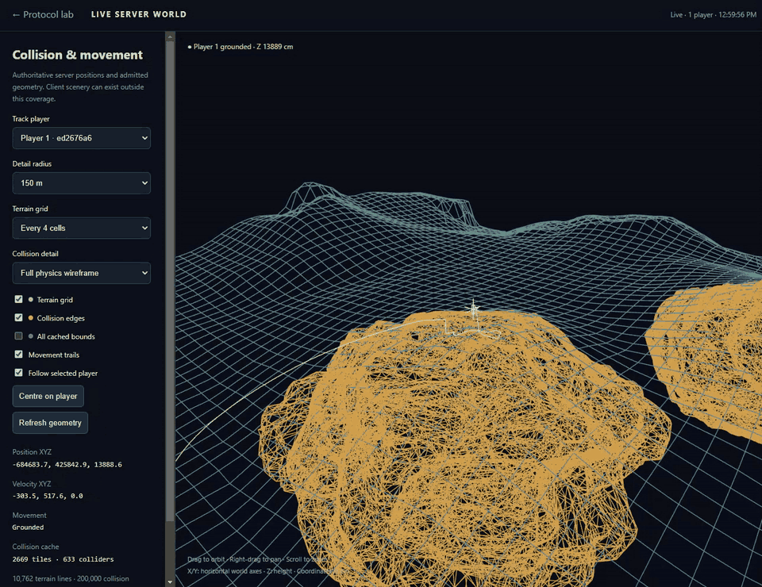

<div align="center">

# Ashes Server Lab

**A small beginning for a very big world.**

Ashes Server Lab is an experimental open-source **Ashes of Creation private server / server emulator** written in **C++20**.
It supports local Verra exploration, movement, flight and live browser tools, with substantial bugs and missing systems. This independent server-emulation and reverse-engineering lab is a contributor starting point, not a complete MMORPG server.


**[Project website](https://anthonyogorman.github.io/ashes-server-lab/)** · **[Get started](#get-started)** · **[FAQ](docs/FAQ.md)** · **[Live demo](#see-it-running)** · **[What works](#what-works-today)** · **[Help build it](CONTRIBUTING.md)**

</div>

> **Bring your own client.** This repository contains lab source and interoperability definitions. It does not include the game, extracted terrain, an Unreal SDK dump, Epic's EOS SDK, or Oodle. The GIFs show a separately installed client.

> **Development paused, 2026-10-08.** The latest server, client-testing bridge, research scripts and unfinished work are saved in this source checkpoint. See the [pause handoff](docs/PAUSED_DEVELOPMENT.md) for verified results, pending work and local evidence locations.

## Why this exists

This is an **AI-generated “one-shot” prototype**, followed by iterative debugging and a lot of checking against one real client build. It is very buggy. The goal was to get a character into the world, moving over terrain, and leave a useful starting point for someone who wants to invest more time, skill, and tokens in developing a private server.

The motivation is simple: players should have a chance to explore the world they cared about. Development was [reported to have halted in early 2026](https://www.pcgamer.com/games/mmo/2-days-after-promising-it-was-still-worthy-of-your-investment-the-most-successful-kickstarter-mmo-ever-was-canceled-and-its-team-laid-off-the-developers-and-staff-acted-in-good-faith-and-deserved-better/). This is an independent community experiment, with no affiliation with or support from Intrepid Studios.

There is **no actual combat or MMORPG gameplay here**. Think of it as an exploration sandbox and a head start for contributors, with the useful work and the rough edges both visible.

## See it running

These previews come from player-recorded sessions in the real client and Web UI.

### In-game exploration



*Explore Verra with the locally connected character, including movement, jumping and flight.*

[View the full exploration GIF](docs/media/exploration-full.gif)

### Live Web UI



*The live viewer follows the connected player over server terrain. Cyan is landscape terrain; amber is the local collision wireframe. Coordinates, movement state and the player marker update as the character moves.*

[View the full live-view GIF](docs/media/live-world-full.gif)

Each inline preview is an eight-second excerpt played at the original speed. Full-length GIFs preserve the complete 30-second exploration and 23-second Web UI recordings, with fewer frames and a smaller image to keep downloads manageable. The repository contains GIFs only; audio, recording metadata and original videos are excluded.

The recorded lab includes an older, incomplete prop cache. **The repository defaults to terrain-only collision.** Buildings and scenery visible in the client, or amber wireframes in the recording, are not evidence of complete server prop collision. No geometry from that local prop cache is distributed. See [media notes](docs/media/README.md).

## What works today

| Area | Current state |
| --- | --- |
| Local connection | Native C++ launcher tether, lobby, world handshake and one local account |
| Character | Selected character name, possession and HUD; health, mana and stamina bars initialized from configurable local-test values |
| Exploration | Improved walking and a verified stationary jump/gravity fix; configurable speed, collision/gravity toggles and flight altitude controls. Some jitter remains |
| Terrain | Offline extraction from your own archives: 2,669 Verra heightfields, including 82 rotated components, plus one warped landscape collision mesh |
| Settlement foundation | Automatic Winstead platform streaming and matching server collision verified in the configured local lab; wider settlement content and tier transitions remain unfinished |
| Loading readiness | Movement stays locked until character, resources, settlement collision, native floor contact and rendered gameplay readiness are verified |
| Client testing | Reviewed DLL-based automation for login, character selection, Play and bounded movement tests; saved bridge requires local configuration |
| Live tools | Browser dashboard, interactive 3D terrain view, player trails, packet/event inspection and SQLite logs |
| Runtime | C++20 server and locally built EOS compatibility shim; Python and C# are offline setup tools |
| Combat / NPCs / quests | Not implemented |
| Production multiplayer | Not validated; current evidence is one locally connected player |

### Latest progress — 2026-10-08

Walking has improved: a controlled post-loading W test travelled about **12 metres with zero server corrections**, and an earlier **36.18-metre Winstead seam test** stayed grounded throughout the sampled route. Some jitters and rubberbanding still occur; these short trials do not establish full movement parity.

The stationary jump now uses the current client's ordinary gravity (**−1225 cm/s²**) and jump velocity (**900 cm/s**). The repeat produced **55 acknowledgements, zero corrections**, and about **0.00625 cm maximum prediction disagreement**, compared with four corrections/about 20 cm before the fix. Moving jumps, horizontal air control, slopes and landing behavior still need work.

The configured lab now spawns the **Winstead settlement platform** through the client's native streaming path and admits its matching extracted collision before enabling movement. This fixes the tested floor seam. It covers the platform foundation, not every settlement building or service. The clean package still generates base Verra terrain by default; the private platform collision data is not bundled or generated by the standard terrain setup.

The in-world name matches character selection, and health, mana and stamina bars are initialized and verified. These are local-test resources, not combat or progression systems. A reviewed input DLL now automates login, Play and bounded movement/jump tests. Shift support passed the adapter fixture, but **live sprint speed, activation and stamina consumption remain unverified**.

Loading now waits for native readiness and the current gameplay loading screen to clear before releasing movement. Native inspection/bootstrap work was optimized, but the client's **22-second loading-screen hold remains**, so faster visible entry is not established. Development is paused; see [verification](docs/VERIFICATION.md) and the [handoff](docs/PAUSED_DEVELOPMENT.md) for evidence and remaining work.

### Known rough edges

- **Some walking pushback/jitter persists.** The controlled walking and settlement-floor tests improved, but moving jumps, air control, slopes and other routes still need comparison.
- **The period (`.`) walk toggle can stop server movement handling** until toggled back. Shift/sprint behavior needs investigation. Use normal movement keys for now.
- Speed updates reach the connected character and keep its animation running, but they do not solve prediction differences.
- Terrain collision is implemented; buildings, rocks, foliage, dynamic objects, water behavior and other gameplay collision are not comprehensively implemented.
- Initialization can fail or time out. The UI shows evidence and errors; reconnecting may be necessary.
- Compatibility depends on native offsets, schemas and byte ranges for one exact client. Supporting another build requires real investigation.
- Some code is dense and AI-generated. Passing tests is not a claim of protocol completeness or production readiness.

## Supported client

Verified on **2026-10-07** from the installed Steam manifest, executable metadata, executable SHA-256 and a live session:

| Identifier | Value |
| --- | --- |
| Steam App ID | `4124950` |
| Steam Build ID | **`21564631`** |
| Executable version | **`AOC-CL-438018`** |
| Unreal Engine version | `5.6.0-438018` |
| Depot / manifest | `4124951` / `5983602515922551495` |
| Executable SHA-256 | `4f1cd43ceeb89190f048734efd4d63152b9f8e11fa31fc41093b0d90f4a1cd43` |

This matched Steam's public branch in the [SteamDB depot listing](https://steamdb.info/app/4124950/depots/) when checked. **“Latest Steam client” is not a compatibility guarantee.** The setup and launcher reject a different executable hash. Supply your own matching installation; no client download is provided.

## Get started

### 1. Install the build tools

Use Windows x64. You need:

- **Visual Studio 2022**, Desktop development with C++, a Windows SDK and the C++ CMake tools. [Microsoft's CMake setup documentation](https://learn.microsoft.com/en-us/cpp/build/cmake-projects-in-visual-studio?view=msvc-170).
- **[MSYS2](https://www.msys2.org/)** for the dependency DLLs. The server itself is compiled with MSVC.
- **Python 3.10+** and NumPy for offline collision decoding.
- **[.NET 10 SDK](https://dotnet.microsoft.com/en-us/download/dotnet/10.0)** for the offline archive extractor.
- Your matching client installation and your own compatible Windows x64 **`oodle-data-shared.dll`**, for archive decompression. Supply this from an installation/tool you are entitled to use. It is not included.

In an MSYS2 terminal, install the MINGW64 dependency packages:

```sh
pacman -S --needed mingw-w64-x86_64-nghttp2 mingw-w64-x86_64-sqlite3 mingw-w64-x86_64-openssl mingw-w64-x86_64-gcc-libs
```

In PowerShell, from this repository's root:

```powershell
python -m pip install numpy
powershell -NoProfile -ExecutionPolicy Bypass -File .\CPP\tools\Build-CPP.ps1 -Configuration Release
```

The build creates the MSVC import libraries from your dependency DLLs, builds the native targets, copies their runtime dependencies beside the executables, and runs the source-only tests. The default dependency directory is `C:\msys64\mingw64\bin`; pass `-DependencyBin 'D:\msys64\mingw64\bin'` if yours differs. A fresh build does not require the game or extracted terrain.

### 2. Prepare your own client

Close the game first. Replace the example path below with the installation directory containing `Game\AOC`:

```powershell
powershell -NoProfile -ExecutionPolicy Bypass -File .\CPP\tools\Configure-Lab.ps1 `
  -ClientRoot 'D:\SteamLibrary\steamapps\common\Ashes of Creation' -InstallLocalEOS
```

This verifies the executable, generates nine reviewed code ranges from **your own executable**, writes the ignored `CPP/config/backend.json`, backs up the matching original EOS library under ignored `CPP/data/client-backup/`, and replaces that client's EOS library slot with the **locally built** `LocalEOSConnect.dll`.

The shim supplies a minimal local account/Connect interface. It does not connect to Epic services or implement production authentication. The installer refuses an unexpected EOS library. A separate copy of your client can be used if you prefer to keep the Steam installation untouched.

To restore the original library later, close the client and run:

```powershell
powershell -NoProfile -ExecutionPolicy Bypass -File .\CPP\tools\Configure-Lab.ps1 `
  -ClientRoot 'D:\SteamLibrary\steamapps\common\Ashes of Creation' -RestoreOriginalEOS
```

Keep the backup until you have restored the original library. After rebuilding the shim, run the installer again; restore the previous original first if the installer reports an unexpected existing shim.

### 3. Generate terrain locally

The extractor reads the installed IoStore archives. **You do not need to visit the world as a character, or even run the client.** Build-matched terrain type definitions and observed class-default collision settings are included; actual terrain is generated privately from your own files.

```powershell
powershell -NoProfile -ExecutionPolicy Bypass -File .\CPP\tools\Export-Terrain.ps1 `
  -OodleLibrary 'D:\YourTools\oodle-data-shared.dll'
```

This restores pinned parser packages from NuGet, builds the extractor, scans Verra heightfields and its warped collision mesh, checks archived collision overrides, decodes the cooked Chaos buffers and validates the result with the native C++ consumer. Archive scanning takes time and uses memory/disk space. Output stays under ignored `CPP/data/terrain-offline/`.

The decoder preserves transforms, rotated tiles, holes and sample quantization. Unknown collision overrides fail admission. The default active cache covers **Verra landscape terrain only**. Other installed maps are separate because their coordinates can overlap; see [terrain details](docs/TERRAIN.md).

### 4. Click to play

Double-click **`Start C++ Client.cmd`** at the repository root. It starts the native backend if needed, starts the local services, launches the game visibly on the normal Windows desktop, and opens:

```text
http://127.0.0.1:8865/
```

In the game, select **Ashes C++ Lab**, select/create a character, and press **Play**. The dashboard opens the lobby flow rather than launching a map directly, so character initialization and the HUD can complete.

Use the dashboard to change speed while connected. Start near **600 cm/s**. **Fly** disables gravity and collision; the altitude buttons move you up/down 10 metres. **Normal movement** restores both toggles. The `.`, Shift and remaining prediction issues above remain open. The saved DLL testing bridge can automate this flow in a configured research workspace; it is not a portable one-click setup for a fresh installation.

If you only want the backend in a terminal:

```powershell
.\CPP\build\msvc\Release\ashes_lab.exe --root .\CPP --start-services
```

| Service | Default address |
| --- | --- |
| Web dashboard | `http://127.0.0.1:8865/` |
| Live 3D view | `http://127.0.0.1:8865/world.html` |
| Lobby | TCP `127.0.0.1:16051` |
| World | UDP `127.0.0.1:18089` |
| Launcher tether | TCP `127.0.0.1:18090` |

Services bind to loopback. This package is a local lab; hosting a public server requires substantial additional work.

### Troubleshooting

- **Build cannot find Visual Studio/CMake:** install the 2022 C++ workload, Windows SDK and C++ CMake tools. The build script deliberately selects Visual Studio 2022.
- **Missing dependency DLL:** use the MINGW64 packages above and point `-DependencyBin` at their `mingw64/bin` directory. Do not mix UCRT64 DLLs with these import libraries.
- **Unsupported client or EOS hash:** use the exact client above. Restore the original EOS slot before installing a newly built shim; do not bypass the hash check.
- **Terrain missing / blank live view:** finish Export-Terrain, then restart the lab or click Reload collision cache. A full cache can take time to load at startup. The live view needs a joined player to centre on.
- **Client audible but invisible:** use this launcher, which selects `winsta0\default` and a normal visible game window. Close any previously running hidden instance first.
- **World visible but no character/HUD:** connect through the lobby, select the world and press Play. Check initialization/readback errors on the dashboard; reconnect if initialization timed out.
- **Pushback or frozen walking:** see the known issues. Normal movement keys and flight are the current exploration paths; the period-key walk toggle and prediction still need work.

## Develop from here

```text
CPP/src/             Native lobby, protocol, movement, collision and client initialization
CPP/include/ashes/   Native interfaces and types
CPP/native/          Local EOS compatibility shim and input adapter sources
CPP/web/             Dashboard and dependency-free 3D wireframe renderer
CPP/config/          Example configuration and build-matched interoperability definitions
CPP/tools/           Build, client setup and offline terrain extraction
CPP/tests/           Source-only checks and optional local terrain validation
client-testing/      Guarded DLL/native observation and input research tools
client-research/     Authored research notes, scripts and interoperability metadata
docs/                Architecture, terrain, roadmap, media and third-party notices
```

Read [the architecture](docs/ARCHITECTURE.md), [the contributor guide](CONTRIBUTING.md) and [the roadmap](docs/ROADMAP.md). The next work is moving-jump/air-control and slope parity, live sprint/stamina verification, settlement tier transitions, initialization reliability, and a maintainable protocol implementation. Large gameplay features come after that foundation. Gameplay development remains paused at this checkpoint.

## Validation and scope

The latest pre-pause lab Release passed **all five CTest suites**: **530 protocol/core, 109 movement, 12,077 private terrain, 11 executable-identity cache and 11 loading-readiness checks**. These are historical results for the tested workspace build; the exported checkpoint's portability adaptations have not been rebuilt or retested.

The earlier **2026-10-07 packaged build** passed **86 source-only checks**, **9 local EOS ABI/behavior tests**, and the complete offline setup with **11,452 public terrain checks**. Terrain checks are registered only after local data is generated when CMake is configured; the executable can also be run directly. Counts differ by version and availability of private fixtures.

The original local lab passed **12,071 terrain checks** with two extra runtime reference tiles, plus **487 earlier checks** including 101 terrain-dependent baseline movement steps. Those private reference tiles are deliberately not distributed. The public terrain suite validates every loaded heightfield, holes, rotations, warped-mesh floors and sweeps, reload behavior and collision admission; its check count differs without private references.

The recordings predate the latest loading, settlement-floor and stationary-gravity fixes. Saved native observations and server traces document those newer results separately. Neither the recordings nor the short tests demonstrate combat, complete prop collision, production multiplayer or full native movement parity. See [verification notes](docs/VERIFICATION.md).

## License and contents

Original lab code is provided under the [MIT license](LICENSE). Third-party headers and dependencies retain their own licenses: [notices](docs/THIRD_PARTY.md). Game names, client-rendered imagery and game content belong to their respective owners and are not covered by this code license. Do not contribute client binaries, extracted game assets, account data or proprietary SDK libraries.

If you build on this, please share reproducible fixes and measured results. The aim is to give the next person a working foothold.
