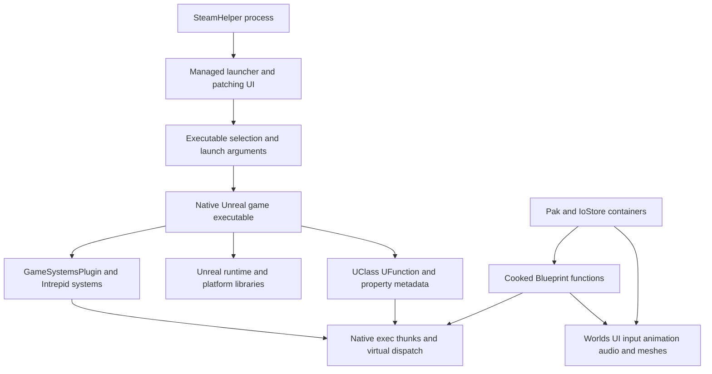

# Ashes of Creation client architecture and findings

The installed client combines a managed launcher, a large native Unreal executable, reflected gameplay systems, and cooked assets. The file, symbol, instruction, and asset inventories cover the accessible installation broadly. Behavioral understanding is still partial; reviewed examples below identify concrete paths into the larger implementation.

## Architecture

Movement collaboration now also traces enabled time-discrepancy processing, shared-frame accumulation and float clock writes, the replicated CharacterInfo world-name source, and all six health/mana/stamina record IDs/types/scopes. See MOVEMENT_NETWORKING.md's resource/name/timing follow-up. Static 25-output/36-snapshot verification and a direct live read-only Owner field3/EveryoneProxy field6 cache proof are preserved. These do not establish exact sprint speed/cost, production stat defaults, packet acceptance or complete collision/server parity.



Arrows show the inspected composition and dispatch relationships. They do not assert that every subsystem or runtime transition is understood.

## Recovered structure

| Layer | Recovered evidence | Interpretation |
| --- | --- | --- |
| Installation | 1,132 files and fingerprints for executable code, TOCs, and manifests | Includes 744 PE modules: 640 managed and 104 native |
| Main native executable | 570,754 exception-table code ranges and 2,624 supplemental named entry blocks in the initial pass | Ranges can be fragments; leaf and inlined functions need separate treatment |
| Native instructions | 37,738,458 decoded instructions and 2,308,594 direct calls in the initial range scan | 568,345 ranges decoded fully; 2,409 decoded partially |
| Unreal SDK | 15,432 types, 72,150 properties, and 22,235 reflected methods | Generated declarations and ProcessEvent wrappers; not original function bodies |
| Static name links | 19,632 SDK methods associated with execution-pointer candidates | Table layout and owner inference are recorded; shared pointers can have multiple names |
| SDK enums | 3,123 enum types and 20,953 numeric values | Declaration provenance is retained; enum presence alone does not establish use |
| Saved reflection | 1,146 distinct native addresses from matching historical snapshots | Corroborates selected registered functions for the exact executable hash |
| Archives | 182,278 virtual files and 158,012 asset registry entries | Asset presence does not establish active gameplay behavior |
| Package headers | 8,093 selected packages and 264,827 exports | Header names, classes, flags, and sizes are available |
| Blueprint scripts | 9,380 function scripts, 114,949 top-level expressions, and 382,342 total expression nodes | All decoded scripts reached EndOfScript and had ordered statement offsets; operand semantics remain candidates |
| Blueprint calls | 44,875 call references, 32,024 linked to native pointer candidates | Virtual/delegate dispatch still depends on runtime context |
| Blueprint fields and flow | 49,915 function-local fields and 105,592 partial flow relationships | 10,093 computed/stack targets remain unresolved; switch expressions are not expanded |
| Blueprint class metadata | 624 terminal-metadata candidates, with 452 fields, 303 function-map entries and two interface records | 6,816 partial exports are explicit gaps; general default objects remain undecoded |
| Launcher reconstruction | 14,932 MethodDef records in eight assemblies, plus reconstructed C# | Includes generated protobuf code and embedded supporting libraries |
| All managed modules | 486,776 MethodDef records and 450,597 readable IL bodies across 640 installed modules | Includes framework libraries and separate copies; broader catalog is metadata and IL fingerprints |
| All native modules | 9,514 exports and 1,361,871 executable exception ranges | Includes supporting libraries and separate copies; five non-AMD64 modules have no supported exception-range parse |
| Client protobuf | 107 message/service entries in recovered descriptors | Declared schema, not proof of runtime use of every field |

The main executable's exception records include 105,938 chained fragments, grouped under 464,816 distinct unwind roots. Roots are compiler unwind anchors, not a census of all logical functions. The supplemental scan now has 3,454 entry blocks from named pointers and core direct calls. Decompilation counts change as the queue progresses; see `coverage.json` and `index/decompile-summary.json`. No percentage of complete behavioral understanding is claimed.

## Subsystem map

| Subsystem | Main entry points and evidence | What remains |
| --- | --- | --- |
| Launcher and startup | `IntrepidStudiosLauncher.dll`, `Patcher.dll`, `SteamHelper.dll`; launch view model, local tether, executable selection | Reconcile launcher variants and all failure paths |
| Core gameplay | `GameSystemsPlugin`: 4,304 SDK types and 7,767 reflected methods | Distinguish dispatch wrappers, implementations, shared stubs, and unused features |
| Character and lobby | AoCCharacterCreationController, PlayerCharacter, character DTOs, customization and appearance types | Trace complete state transitions and per-build defaults |
| Movement and input | Cooked action/binding atlas; constructor-linked AoC movement overrides, custom direction codec, gait flags, speed and correction paths | Effective sprint/stat parameters, complete wire layout, timing/replay rules, collision solver and geometry; see MOVEMENT_NETWORKING.md |
| Abilities and combat | AoCAbilityComponent, AbilityInst, projectile and targeting interfaces | Trace activation, prediction, resources, cooldowns, and effects |
| Inventory and items | InventorySlotBase, item storage, slot information, item icon widgets, inventory Blueprints | Follow ownership, action validation, and all item UI paths |
| Crafting | CraftingStationBase, FastCraftingMenu, recipes and profession-related reflected types | Resolve virtual checks and recipe data semantics |
| Quests and dialogue | QuestConsumerComponent, replicated quest caches, narrative and dialogue source paths | Trace event matching, state changes, conditions, and UI propagation |
| World and streaming | World/Level/partition types; 16,173 World registry entries and 44,515 AreaMapChunk entries | World entries include generated cells; distinguish maps, cells, and runtime activation |
| UI | 727 WidgetBlueprint and 727 WidgetBlueprintGeneratedClass entries; UMG/CommonUI SDK declarations | Follow bindings, widget defaults, state, and user actions |
| Animation and appearance | 11,047 AnimSequence, 9,040 SkeletalMesh, 3,812 AnimMontage registry entries | Trace skeletal setup, animation graphs, retargeting, and customization assembly |
| Audio | AkAudio reflected types, 2,496 AkAudioEvent registry entries, decoded audio Blueprints | Resolve audio assets and complete event routing |
| Rendering and geometry | Materials, Niagara, meshes, platform imports, collision and physics declarations | Recover defaults and connect engine code to per-asset data |
| Client service interfaces | Embedded protobuf descriptors, IntrepidNet/EOS types, launcher IcsProtos | Map client consumers and state handling without implementing a server |

Catalogs enumerate names across these areas. Names alone establish an interface or asset, not a working feature or complete mechanic.

## Reviewed behavior examples

### Sprint requests store an input preference

The registered `AoCCharacterMovement.SetSprintRequest` thunk at RVA `0x58d9e40` reads a boolean from the Unreal script frame and calls RVA `0x5ec4de0`. The latter contains exactly:

```asm
mov byte ptr [rcx + 0x11d0], dl
ret
```

The SDK identifies offset `0x11d0` as `bWantsToSprint`. This call stores the sprint request flag. It does not itself demonstrate a speed change; subsequent movement code must consume the flag. The exact seven-byte fragment and executable hash are preserved in `proofs/sprint-request-setter.json` and `.bin`, with the dispatch thunk in `decompiled/initial/function_58d9e40.c`.

### Movement restores custom input before timestamp-based simulation

The focused [movement specification](<E:/Ashes Of Creation GPT/client-research/MOVEMENT_NETWORKING.md>) links AoCCharacterMovement's constructor to primary table `0xb110970`. Custom serializer `0x63e7a80` records four one-bit direction predicates, loading each axis as −1, 0, or +1. Received-move handler `0x5ec20b0` restores this input into the character before timestamp/delta/flags/acceleration processing. Walking, sprint request, and mantle receiver masks have on-disk defaults `0x10/0x20/0x40`; they are globals whose runtime values can differ.

GetMaxSpeed selects direction/mode/walk-state values and applies stat, owner, effect, and physical-material modifiers. Constructor MaxSprintSpeed is not directly read by the reviewed ground selector; effective sprint speed remains unresolved. One correction branch includes a speed-times-elapsed-time allowance. IsWalkable compares the impact normal against gravity direction and per-component slope overrides. Full packet serialization, collision physics, acknowledgment/replay semantics, and live configuration still require validation. Seventy focused pseudocode range outputs are saved; 12 static consistency checks pass for selected links and evidence, without establishing full gameplay equivalence.

### Inventory cooldown handling updates widget state

`InventorySlotBase.HandleCooldown` enters through RVA `0x5ae9b00` and tail-jumps to RVA `0x678d520`. The recovered body checks the cooldown material and text widget before updating them. It obtains a remaining percentage and a remaining-time value, branches when the percentage is at most zero, and writes the material's scalar parameter named `percent`. In the positive branch it updates the cooldown text and uses the two configured font-size fields.

SDK fields match the accessed offsets: CooldownBorder `0x3d0`, CooldownTextBlock `0x3d8`, CooldownMaterial `0x3f0`, FontSize1 `0x3f8`, and FontSize2 `0x3fc`. Helper RVA `0x678a7a0` finds the owning character's AbilityComponent at `0xe20` and calls virtual slots `0x658` and `0x648`. The corresponding AoCAbilityComponent reflection thunks identify these as GetRemainingAbilityCooldownPercent and GetRemainingAbilityCooldown. A separate branch invokes item-associated logic before these getters; its full effects and the percentage calculation remain unreviewed. The dispatch entry is a bounded leaf block; its decompiled output follows the tail jump, so its entry-block size is not the size of the implementation. See `decompiled/initial/function_678d520.c` and `decompiled/bulk/function_678a7a0.c`.

### Ability validation combines owner, state, and record rules

The concrete cooldown dispatch chain and selected getter behavior are now documented in `COOLDOWN_PATH.md`. The ability-component constructor installs table `0xb6873d0`, linking remaining time, remaining fraction, and active-state checks to RVAs `0x6ba73d0`, `0x6ba7540`, and `0x6bb40c0`. GUID or nonzero shared-tag matching selects an entry. The numeric paths use the stored synchronized end time; the active check returns bCooldownTriggered. Constructor-table links remain distinct from runtime/subclass dispatch. Update/expiry/prediction behavior and clock maintenance still need review.

`AoCAbilityComponent.CanUseAbility` at RVA `0x5cd3120` parses an ability record and TestsToIgnore set, then calls RVA `0x6b963f0`. That helper checks OwningChar at `0x838`, obtains intermediate context, and calls the larger validator at RVA `0x6b96590`. The validator also checks OwnersStats at `0x848` and contains movement, mounted-state, weapon/item, cooldown, expression, and casting-related exits.

The SDK's two-byte AbilityCastResult stores Response at byte zero and FailureType at byte one. This matches constant returns such as `0x1401` = USE_Fail/InCooldown, `0x1301` = USE_Fail/CastInProgress, `0x2502` = USE_AllFail/InvalidOwnerOrStats, and `0x2301` = USE_Fail/Unloaded. A zero result corresponds to USE_Success/None.

One concrete condition reads AoCAbilityRecordBase.bDisableDuringCooldown at `0x2e8`; when set and virtual slot `0x668` reports a cooldown, it returns `0x1401`. The registered IsAbilityOnCooldown thunk uses that same slot. Other conditions read bUsableWhileSwimming `0x9c1`, bUsableWhileWalking `0x9c2`, and bUsableWhileMounted `0x9c3`, with corresponding failure codes. These observations map selected client checks. The full prerequisite order, TestsToIgnore behavior, expression evaluation, virtual implementations, and prediction/network consequences remain to be reviewed.

See `decompiled/bulk/function_5cd3120.c`, `function_6b963f0.c`, `function_6b96590.c`, and `proofs/trace_5cd3120.json`.

### An inventory Blueprint creates design-time preview containers

The decoded `WBP_TetrisInventory.PreConstruct` copies IsDesignTime into its persistent frame and enters ExecuteUbergraph at statement 367. A false flag exits through the flow stack. The true path checks ContainersBox validity and whether it already has children. An invalid box or one with children exits. Otherwise, a counter runs from zero through two inclusive, creating WBP_TetrisResourceContainer widgets and adding each to ContainersBox.

This is an inferred design-time preview path from the decoded control flow. It does not establish the runtime inventory population logic. The preserved JSON and annotated listings are `proofs/tetris-preconstruct-blueprint.json` and `proofs/tetris-inventory-blueprint.md`.

### Character names undergo several client checks

`AoCCharacterCreationController.IsValidCharacterName` dispatches from RVA `0x58d9410` to RVA `0x5eab520`. The implementation compares the candidate length against two controller members, uses the literal regular expression `^[\p{Ll}\p{Lu}\p{Lt}\p{Lo}]*$`, checks existing character-list names, and contains a comparison using the literal `gm`.

The implementation also accesses the SDK's InvalidCharacterNameBadText, InvalidCharacterNameLengthText, InvalidCharacterNameCharText, InvalidCharacterNameGMText, and InvalidCharacterNameTakenText fields. The exact boundary values, Unicode normalization, filter helper, and `gm` comparison semantics still need validation. The client checks do not establish what a remote service accepts. See `decompiled/initial/function_5eab520.c`.

### Character play requests depend on controller state

`RequestPlayCharacter` at RVA `0x58d9960` parses a reflected character structure, calls RVA `0x5ebf310`, and destroys temporary data. The implementation consults the controller's character list and the flag identified by the SDK as `bNoAuthCharacterCreate` at `0x1e31`. It uses the game instance and a service pointer, handles failed request outcomes, and updates lobby-related state.

This establishes a client request path and prerequisites visible in the code. The full state enum, callback lifecycle, and remote response handling remain to be traced. See `decompiled/initial/function_5ebf310.c`.

### Launcher arguments come from connection information and local settings

ILSpy's `Launcher.ViewModels.PatchingViewModel.CreateGameExeArgs` starts from the returned launch command's argument string or a local argument override. It appends `LauncherTetherPort=<port>`, optional crash-debugging arguments, and `-NOSPLASH`. The launch method obtains connection information, checks the executable and patch status, checks whether the game is already running, and then starts the process.

`Patcher.LocalServer` creates the launcher tether on loopback with a dynamically selected port. `SteamHelper.Program` provides a line-oriented command loop for Steam ID, auth-ticket lifecycle, and Steam-directory requests. These are observations from locally decompiled source; none of these client operations was executed during this research pass.

See `decompiled/managed/IntrepidStudiosLauncher/Launcher.ViewModels/PatchingViewModel.cs`, `decompiled/managed/Patcher/Patcher/LocalServer.cs`, and `decompiled/managed/SteamHelper/SteamHelper/Program.cs`.

## Naming and decoding confidence

Unreal has two relevant table layouts here. Metadata constructor rows store code then name; native registration rows store name then code. Pairing both as name then code would associate a name with the next metadata accessor. The linker validates accessor names against the referenced FunctionParams structure and excludes them from execution-thunk candidates. Multi-entry table groups receive an owner only when their method-name sets uniquely intersect the supplied SDK.

Saved reflection corroborates selected thunk addresses, but many static labels remain inferred. A shared thunk or optimized function may serve several classes or methods. Likewise, a source-path reference identifies diagnostic provenance and may refer to an inline helper rather than the enclosing routine's definition.

Blueprint decoding uses CUE4Parse's Ashes-specific serialization, including its extra function metadata handling. Only UFunction exports use the minimal schema definitions. General class defaults, components, data tables, input mappings, and other object properties still need correct per-type schemas. Structural script checks cover matching names, ordered statement offsets, and EndOfScript; they do not prove every operand interpretation or runtime outcome.

A separate class pass uses empty metaclass schemas and requires cooked terminal UClass records. Of 7,440 selected class exports, 624 pass this structural gate and 6,816 remain partial. The loader can return incomplete objects after an internal parse failure, so a non-null object is not counted as successful decoding. The imported class summary, rather than the initial loader-return count, determines coverage.

A newer, separate SDK-schema experiment passes fatal-error, terminal-metadata, exact byte-consumption, and package-reference checks for all 7,440 selected class exports. It recovers 98,824 child fields, 9,380 function-map entries, and 15,373 metaclass property entries. Default-object decoding yields 6,907 exact-consumption candidates, 277 failures, and 256 consumption gaps. These inferred schemas and values remain separate from the empty-schema baseline. Unknown zero-valued fields can still be skipped; inherited/omitted defaults and semantic type interpretation require review. The declaration-index repair and all experiments are documented in `RESEARCH_LOG.md` and `ASSET_SCHEMAS.md`.

## Remaining coverage gaps

Selected configuration decoding now covers 653 exports with exact payload consumption and no recorded parser warnings: input actions/config/context, data tables, behavior trees, blackboards, and state trees. `INPUT_CONFIGURATION.md` records 170 cooked input bindings and table coverage. The 526,357 recovered table rows include 524,288 rows in two biome grids. Separate reference checks match 33,275 exports; 41,541 references outside the header subset remain unresolved. This gives data and relationship candidates, not complete execution semantics or decoded nested AI/input objects.

The main native code is indexed broadly but much of its pseudocode remains queued and almost all code still needs semantic review. Chained exception fragments are indexed with parent roots rather than queued as independent functions. Already generated fragment pseudocode has a separate unreviewed status. One fragment at RVA `0x9284703` failed Ghidra's varnode adjustment; its root `0x92844e0` has pseudocode, but complete fragment incorporation is still unverified. Six oversized entry ranges need separate treatment. Indirect calls, virtual tables, dynamically resolved APIs, omitted leaf routines, optimized/inlined code, type recovery, and aliases limit the native call graph.

Ghidra's completion flag does not establish complete control-flow reconstruction. The output diagnostics catalog records explicit failures, bad-data halts, and warnings such as unresolved jump tables or truncated flow. The schema-research checkpoint recorded 975 outputs with control-flow warnings, two with bad-data halts, and seven explicit failures; ongoing batches can change these counts. Use timestamped `coverage.json` and the diagnostics catalog for the current snapshot. These require instruction-level review; some may represent real trap paths. All native pseudocode remains unreviewed unless a specific behavior is documented above.

The archive provider reports `global.utoc` as unmounted. Package header and script resolution succeeded for the selected packages, but this does not establish access to every entry in that container or every data payload. The asset registry contains no dependency-node/package-record section in this parse; script calls and header references provide separate relationships.

The installed EOS DLL is a local replacement, and the SDK and runtime snapshots have distinct provenance. The original PDB is absent from the installation inventory. Original source names, comments, design intent, and service-side implementations cannot be reconstructed merely by adding more decompilers.

The research objective remains unfinished. Next work should review complete gameplay paths using decoded scripts, native implementation callees, field layouts, and explicit gaps, while continuing the remaining native queue in checkpointed batches. The saved Codex goal reported Paused during the 2026-10-07 status check; automatic continuation needs the app's goal to be resumed.
