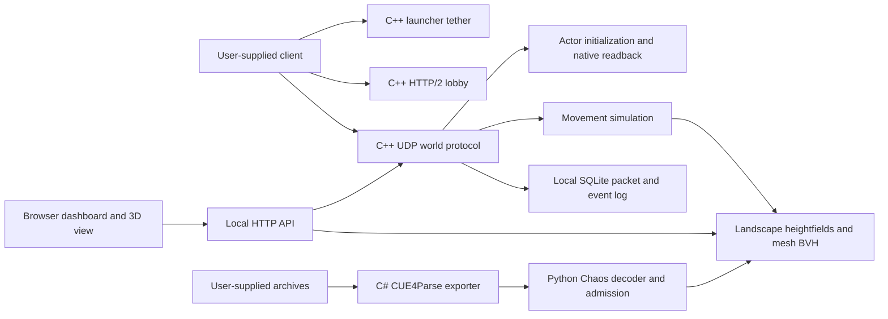

# Architecture

The runtime is native C++20. Python and C# prepare local artifacts offline; they are not alternate servers.

## Native entry points

| Files | Responsibility |
| --- | --- |
| `src/main.cpp`, `src/backend.cpp` | CLI, service lifetimes, loopback HTTP controls, state and packet persistence |
| `src/client.cpp` | Executable/SDK identity checks, lobby launch arguments, explicit normal Windows desktop |
| `src/lobby.cpp`, `src/contracts.cpp` | HTTP/2 gRPC framing, build-matched protobuf metadata, local character records |
| `src/protocol.cpp`, `src/stages.cpp` | World packet/bunch handling and authored actor/property/RPC stages |
| `src/initialization.cpp`, `src/speed_sync.cpp` | Initialization sequencing and verification, live speed-stat updates |
| `src/inspection.cpp`, `src/live_proofs.cpp` | Read-only live process/reflection evidence, current identities and native layouts |
| `src/movement.cpp`, `src/collision.cpp` | Movement timing, capsule sweeps, floor queries, heightfields, mesh BVH |
| `native/eos_connect_local/connect_local.cpp` | Small local Connect ABI implementation, not Epic's SDK |

## Connection flow

The launcher starts tether/lobby/world services and opens the client with `-LauncherTetherPort`, a separate user profile and local online-subsystem overrides. The client selects a world/character through the lobby. A local game token leads into the native UDP handshake. The server creates controller, pawn, game-state and player-state links and verifies current native object acceptance before completing possession, stats, HUD and BeginPlay.

Identity is pinned to the executable SHA-256. Reviewed code ranges are extracted locally from that executable at setup, then compared with the running process. This is intentionally build-specific. It is not enough to change the hash in the config to support a new client.

Movement settings change server simulation immediately. A stat delta updates the client speed and readback verifies the multiplier. Prediction still diverges while walking. The collision world is immutable during use; a reload validates a replacement before swapping it while preserving player state.

## Stored state and controls

Local characters, settings, SQLite logs, process evidence and generated terrain live under ignored `CPP/data/`. Game stdout and per-launch files live under ignored `CPP/runs/`; the separate client profile is also ignored.

`GET /api/state`, `/api/world-view`, `/api/world-geometry`, `/api/connections`, `/api/packets` and `/api/events` supply the dashboard. `POST /api/control` starts/stops services, launches/inspects the client, applies movement settings, changes flight altitude and reloads geometry. Controls are unauthenticated local developer controls, with loopback binding and local Host/Origin checks. Do not expose them as a public admin API.
